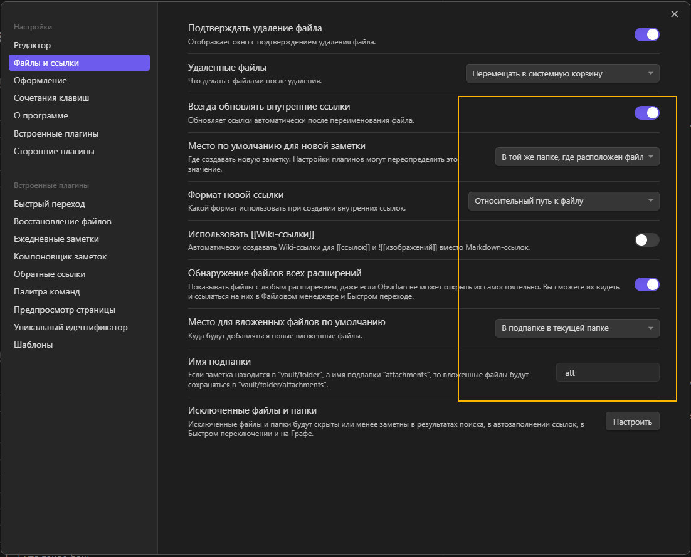

# подготовка

- [x]    сделать виртуалку вин10 пустую
- [x] скачать вин 10 образ
- [x] вин10 вирт  - макстон, 
- [ ]  СХЕМА оболочка-ОС-ядро-выполнение . вин и линь. МИРО
- [ ]   чем записывать экран. обс?
- [x]   виртуалка. обновить павершел. 
- [x] установит гит баш.
- [ ] уст всл
- [ ] установит терминал. 
- [ ] 

- [x] обсидиан - какие настройки обязательные для удобной работы в гитхабе

# PLAN

- [ ] вступление
- [x] подготовка окружения вцелом для работы = мы не рассматриваем назначение команд и синтаксис
- [ ] зачем нужна оболочка - СХЕМА
- [ ] командная строка - какие доступны сразу
- [x] установка: обновление павершел
- [ ] установка: WSL
- [ ] установка: убунту
- [ ] 
- [ ] в чем разница между командными строками. вин против лин
- [ ] что такое баш
- [ ] установка гит баш . зачем гит баш в виндовс
- [ ] 
- [ ] ~~гит баш больше не нужен~~
- [ ] установка - терминал
- [ ] 
- [ ] 
- [ ] необязательное - оформление терминала
- [ ] 
- [ ] 
- [ ] 
- [ ] 
- [ ] 
- [ ] что такое гит как таковой
- [ ] создаем новый репозиторий1 локально
- [ ] наполняем репозиторий1
- [ ] синхронизируем репо1 на гитбаш
- [ ] 
- [ ] установка Обсидиан
- [ ] подключение готового проекта
- [ ] маркдаун. как работают ссылки и рендр
- [ ] изменение настроек: картинка настроек
- [ ] создать заметку, наполнить
- [ ] 
- [ ] вставить картинки, из
- [ ] 
- [ ] создаем новый репозиторий2  на гитхаб
- [ ] качаем свой репозиторий2 себе на компьютер виндовс
- [ ] репозиторий2 обновляем и отправляем изменения на гитхаб
- [ ] качаем свой репозиторий2 себе на компьютер wsl
- [ ] 
- [ ] качаем чужой репозиторий3 себе на компьютер
- [ ] 

# PLAN 2 CLI
- [ ] 
- [ ] 
- [ ] 
- [ ] 
- [ ] 
- [ ] 
- [ ] 
- [ ] 

