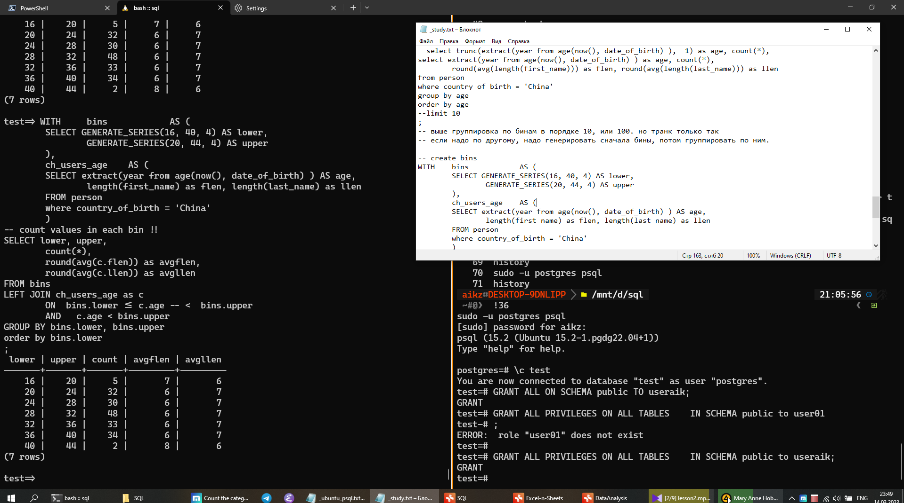
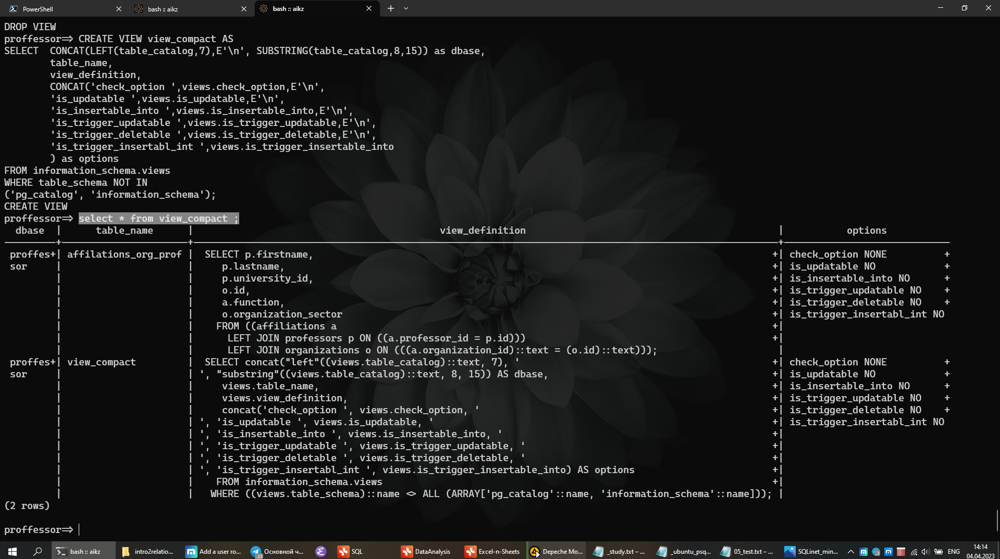

> [Начало](../../README.md) >> Модуль 2

# DataLearn Module 2

#module2 #sql #postgres #csv #psql #shell


# Домашнее задание

**Модуль 2** преследует такие цели:

- База данных. 
	- Установка, подключение. 
	- Cоздание БД, запросы.
- Модели данных.
- База данных в облаке.
- Сервисы визуализации для баз данных.

---

# База данных

## Установка. Подключение

Тут, конечно, есть что описать. Ставил Postgres 15 на Win10, немного поупражнялся. Потом перешел на WSL полностью. Обо всем по порядку.

### Postgres + Win

Далее, далее, все готово :). Встроеный pgAdmin работает. DBeaver подключил, сложностей нет. Сразу перешел на psql клиент. Не знаю почему, но по моему мнению - изучать стоит sql прямо из консоли. Во первых, там есть все. Во вторых, нет перегрузки интерфейса. Залет в любую IDE похож на случайное попадание школьника в кабину пилота самолета, становится страшно от этой кучи кнопок xDD. А так ничего лишнего, только то что выучил. На скринах WSL, это для примера.






Мне сильно помог вот этот парнишка [freeCodeCamp.org
Learn PostgreSQL Tutorial - Full Course for Beginners](https://www.youtube.com/watch?v=qw--VYLpxG4), он хорошо показал как пользоваться именно консолью, а не IDE. Ну а потом Вы уже сможете под свои потребности подобрать текстовый редактор для SQL или IDE.

На счет самого psql в windows, у него есть косяк с кодировкой. Косячит, даже если у тебя база данных создана в UTF8 и кодировка, везде где можно, выставленна UTF8, ты все равно будешь получать ошибку при выводе, например, `'México D.F.'`.

	ОШИБКА:  для символа с последовательностью байт 0xc3 0xb3 из кодировки "UTF8" нет эквивалента в "WIN1251"

Как исправить?

	-- вот так можно проверить настройки
	SHOW server_encoding;
	SHOW client_encoding;
	
	-- следующее вводить находясь в консоле psql/windows
	SET client_encoding TO 'UTF8'; 
	psql \! chcp 1251

Работает, отлично! Но надо вписывать каждый раз, настройки не сохраняет.

### Postgres + WSL

Установка в пару действий по мануалу с оф сайта postgres. Но нельзя просто так выполнить авторизацию в pqsl в линуксе по логину и паролю xDDD. По умолчанию авторизация по ключам линукса через sudo (запуск с правами суперпользователя). Но делать авторизацию от суперпользователя вообще не лучшая практика, к тому же клиенты типа HeidiSQL, или того-же Бобра, предлагают Вам авторизацию по логину и паролю. И что-бы их из windows подружить вместе с WSL надо немного потанцевать. Бубна не было, пользовался только поиском).

Задача стояла такая: с внешки иметь возможность подключиться к postgres/wsl по моему придуманному логину и паролю.

1. Стартуем сервер

		sudo service postgresql start 

2. Разрешаем самой базе данных принимать авторизацию по логину и паролю, по умолчанию она отключена. Надо найти эти строки и исправить на md5, md5 - это авторизация по паролю.

		sudo nano /etc/postgresql/15/main//pg_hba.conf
		
		# "local" is for Unix domain socket connections only
		local   all          all                         md5
		# IPv4 local connections:
		host    all          all        0.0.0.0/0        md5

3. Запускаем psql, как от суперпользователя root в самом linux через пользователя postgres (который создался на этапе установке базы данных), карочи бред. Для того, чтобы не было мешанины с названиями типа postgres-postgres, создаю в самой базе данных пользователя useraik.

		sudo -u postgres psql 
		
		CREATE USER useraik PASSWORD 'aik123' CREATEDB;

4. Проверяем как работает, уже без sudo.

		psql -U useraik -h 127.0.0.1 -d postgres


В таком варианте мы можем работать от пользователя useraik, создавать свои новые базы данных, генерировать и прочее. Но уже загрузить свои данные из ОС не можем, потому что у нас нет прав. В принципе, это нормально. Всегда можно зайти с помощью sudo (администратора), сделать импорт/экспорт и дальше работать через `useraik` без страха дропнуть соседнюю базу. Если Вы еще ни разу не дропали не ту таблицу, я Вам завидую)).

### Postgres + CSV/SQL

Импорт и экпорт CSV/SQL файлов - это вообще нативная штука. Это как открыть документ Word или сохранить его с другим именем. Тебе всегда надо что-то брать с книжной полки и ставить что-то другое на неё. 


#### Import

Берем [summer.csv](SQL/Source/summer.csv) для примера. Кладем в `D:\summer.csv`. Создаем таблицу в своей базе данных, импортируем. Пути указаны для WSL.

```sql
CREATE TABLE summer (
year integer,
city varchar(30),
sport varchar(30),
discipline varchar(30),
athlete varchar(50),
country varchar(10),
gender varchar(10),
event varchar(50),
medal varchar(10)
);

COPY summer(year,city,sport,discipline,athlete,country,gender,event,medal)
FROM '/mnt/d/summer.csv'
DELIMITER ','
CSV HEADER;
```

Тоже что и выше с помощью SQL файла.  Сохраняете код выше в файл, например, `D:\summer_import.sql` и в psql выполните команду `\i /path/to/file`.

```shell
\i /mnt/d/summer_import.sql
```

Результат будет идентичный.

Вариант импорта снимка таблицы из обочки Linux.

```shell
psql --dbname=mydb --username=postgres -f /tmp/mydb.sql
```

#### Export

Выгружаем целую таблицу или выборку из таблицы в CSV.

```sql
COPY table_contacts TO '/mnt/d/contacts.csv'  
WITH DELIMITER ',' CSV HEADER;

COPY (SELECT * FROM contacts WHERE age < 45) TO '/mnt/d/young_contacts.csv'  
WITH DELIMITER ',' CSV HEADER;
```

Или делаем dump из таблицы в виде SQL файла.

```shell
sudo -u postgres pg_dump --column-inserts --data-only --table=person test_database > table_from_dump.sql
```

Пример выгруженных строк для дампа.

```sql
INSERT INTO public.person (id, first_name, last_name, gender, email, date_of_birth, country_of_birth) VALUES (986, 'Hali', 'Juschka', 'Female', NULL, '1990-08-21', 'Colombia');
```


## Создание базы данных. Запросы

### Задание 1

> *Вам необходимо установить клиент SQL для подключения базы данных. Вы можете посмотреть [инструкции по установки DBeaver](https://github.com/Data-Learn/data-engineering/blob/master/how-to/%20How%20to%20install%20DBeaver.md). Так же вы можете использовать любой другой клиент для подключения к ваше БД.*

##### DBeaver

Добавить новое соединение, заполнить поля. IP хоста смотреть командой `ifconfig` для ubuntu.


##### HeidiSQL

Все тоже самое.


### Задание 2

> *Создайте 3 таблицы и загрузите данные из [Superstore Excel файл](https://github.com/Data-Learn/data-engineering/blob/master/DE-101%20Modules/Module01/DE%20-%20101%20Lab%201.1/Sample%20-%20Superstore.xls) в вашу базу данных. Сохраните в вашем GitHub скрипт загрузки данных и создания таблиц. Вы можете использовать готовый [пример sql файлов](https://github.com/Data-Learn/data-engineering/tree/master/DE-101%20Modules/Module02/DE%20-%20101%20Lab%202.1).*

1. Сделал CSV для каждой таблицы: [orders.csv](SQL/Source/orders.csv), [people.csv](SQL/Source/people.csv), [returns.csv](SQL/Source/returns.csv).

2. Захожу от обычного пользователя, создаю новую базу, подключаюсь к базе `superstore` (автоматом нас кидает в базу postgres).

```shell
❯  psql -U useraik -h 127.0.0.1 -d postgres

Password for user useraik:
psql (15.2 (Ubuntu 15.2-1.pgdg22.04+1))
SSL connection (protocol: TLSv1.3, cipher: TLS_AES_256_GCM_SHA384, compression: off)
Type "help" for help.

postgres=> CREATE DATABASE superstore;
CREATE DATABASE

postgres=> \c superstore
superstore=>
```

3. Создаю таблицы с помощью написанного ранее запроса [orders_create_table.sql](SQL/Source/orders_create_tables.sql) (пути для импорта указаны явно), проверяю созданы ли таблицы, выхожу.

```shell
superstore=> \i /mnt/d/git/DataLearnDE/DE-101/Module2/SQL/Source/orders_import.sql

psql:/mnt/d/git/DataLearnDE/DE-101/Module2/SQL/Source/orders_create_tables.sql:8: NOTICE:  table "orders" does not exist, skipping
DROP TABLE
CREATE TABLE
psql:/mnt/d/git/DataLearnDE/DE-101/Module2/SQL/Source/orders_create_tables.sql:36: NOTICE:  table "people" does not exist, skipping
DROP TABLE
CREATE TABLE
psql:/mnt/d/git/DataLearnDE/DE-101/Module2/SQL/Source/orders_create_tables.sql:45: NOTICE:  table "returns" does not exist, skipping
DROP TABLE
CREATE TABLE

superstore=> \d

              List of relations
 Schema |     Name      |   Type   |  Owner
--------+---------------+----------+---------
 public | orders        | table    | useraik
 public | orders_id_seq | sequence | useraik
 public | people        | table    | useraik
 public | returns       | table    | useraik
(4 rows)

superstore=> \q
```

Это для того, что-бы этот пользователь был владельцем базы и таблиц, тогда не надо перекидывать права на чтение/правку/удаление таблиц.

4. Захожу через администратора, подключаюсь к базе `superstore` (автоматом нас кидает в базу postgres). 

```shell
❯  sudo -u postgres psql     
could not change directory to "/home/aikz": Permission denied
psql (15.2 (Ubuntu 15.2-1.pgdg22.04+1))
Type "help" for help.

postgres=# \c superstore
superstore=#
```

5. Делаю импорт с помощью написанного ранее запроса  [orders_import.sql](SQL/Source/orders_import.sql) (пути для импорта указаны явно). Обратите внимание, что внутри указан разделитель как точка-с-запятой `DELIMITER ';'`, потому что Excel выгружает так.

```shell
superstore=# \i /mnt/d/git/DataLearnDE/DE-101/Module2/SQL/Source/orders_import.sql

COPY 9994
COPY 4
COPY 800
```

Теперь можно подключаться, как обычный пользователь, и уже делать необходимые запросы.

### Задание 3

> *Напишите запросы, чтобы ответить на вопросы из [Модуля 01](https://github.com/Data-Learn/data-engineering/tree/master/DE-101%20Modules/Module01/DE%20-%20101%20Lab%201.1#%D0%B0%D0%BD%D0%B0%D0%BB%D0%B8%D1%82%D0%B8%D0%BA%D0%B0-%D0%B2-excel). Сохраните в вашем GitHub скрипт загрузки данных и создания таблиц.*

По заданию сделал запросы, что-бы получить таблицы, по которым делал дашборд в Excel в первом модуле.

- Вспомогательные [действия](SQL/dashboard/00add.sql).
- ComboChart - [sql](SQL/dashboard/01combochart.sql)
- WaterfallChart - [sql](SQL/dashboard/02waterfall.sql)
- PieChart - [sql](SQL/dashboard/03piechart.sql)
- MapChart - [sql](SQL/dashboard/04mapchart.sql)
- Top5 Subcategory - [sql](SQL/dashboard/05top5.sql)
- KPI - [sql](SQL/dashboard/06kpi.sql)
- KPIYOY - [sql](SQL/dashboard/07kpiyoy.sql)

Вам удобнее их будет посмотреть на [отдельной странице](SQL/superstor_sql_querry.md) с описанием и результами вывода.

---

# Модели данных

### Задание 1

> *Вам необходимо нарисовать модель данных для нашего файлика [Superstore](https://github.com/Data-Learn/data-engineering/blob/master/DE-101%20Modules/Module01/DE%20-%20101%20Lab%201.1/Sample%20-%20Superstore.xls):*
> 
> -   *Концептуальную*
> -   *Логическую*
> -   *Физическую*  
> 
> *Вы можете использовать бесплатную версию [SqlDBM](https://sqldbm.com/Home/) или любой другой софт для создания моделей данных баз данных.*

### Задание 2

> *Когда вы нарисуете модель данных, вам нужно скопировать DDL и выполнить его в SQL клиенте.*

### Задание 3

> *Вам необходимо сделать `INSERT INTO SQL`, чтобы заполнить **Dimensions** таблицы и **Sales Fact** таблицу. Сначала мы заполняем **Dimensions** таблицы, где в качестве **id** мы генерим последовательность чисел, а зачем **Sales Fact** таблицу, в которую вставляем **id** из **Dimensions** таблиц. Такой пример я рассматривал в видео.*

### Результат

Выношу [результат всех заданий](dbmodel/superstore_dbmodel.md) на отдельную страницу, т.к. все преобразования занимают очень много места. Поскольку задания делаю для себя, то описывать буду в полном объеме.


---

тут могу заделать ещ
- еще практика по добавлению норсвинда с чужого гита.


тут что сделать хочу:

- три цсв **OK**
	- создать таблицы для них ОК
	- загрузить все ОК
	- сделать нормализацию
	- данные переложить в нормализованные таблицы
	- 
~~- для каждого пунктка скрипты в постгрес~~


- отдельно команды для загрузки данных в постгрес
	- из цсв ОК
	~~- из скл файлов~~


---
> [Начало](../../README.md) >> Модуль 2