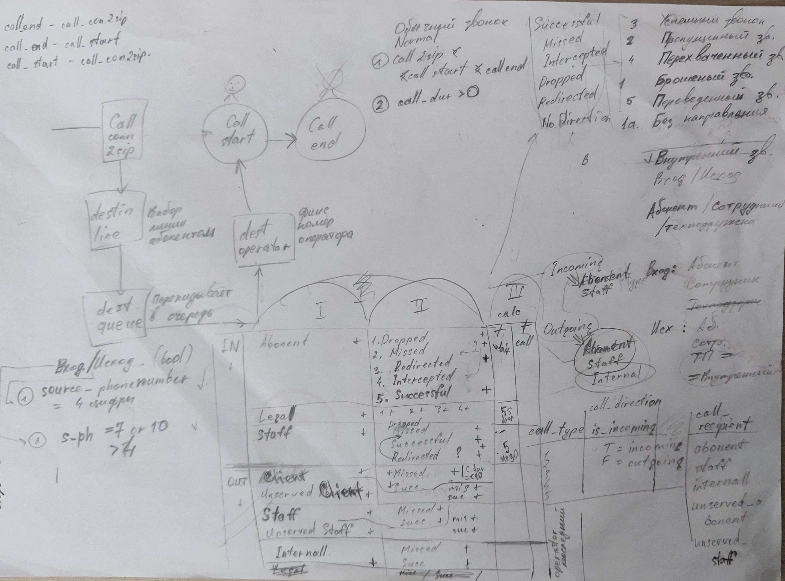

> [Start](../../README.md) >> Module 3

# DataLearn Module 3

#bi #dashboard #tableau #powerbi #looker

# Homework

**Module 3** has the following goals:

- Get acquainted with the main BI tools that are on the market.
- Study one chosen instrument well.
- Make a dashboard.

---

# General

I really didn’t want to do the same reports for Superstore.

Therefore, I took access to the telephone call database at my current job in order to work with **real data** and, in this regard, taste all the delights that can arise in a real project.

And many surprises awaited me :0).

# Report on Client Support calls (Call Center)

First of all, I can’t say that while building dashboards, I learned a lot about PowerBI (more than in the Datacamp courses). By ratio: 50% is SQL and model building, 30% ETL (yes, I had to go to Module 4 and get acquainted with Pentaho, because automation was needed) and the remaining 20% is PowerBI. Yes, in PowerBI you can work with sources and greatly transform data, but complex transformations are simply inappropriate there, as for me (cons at the end).

When you make a report, you have two options:

- get a complete model, then you have access to all sorts of filters in different directions
- get 1 table for the report, build 1 report and get filters within this table

I needed the first one. The hardest thing about working with calls is breaking them down into categories. The original call table is a self-written thing, in which an incoming call (if you compare the caller phone number and recipient phone number) cannot always be immediately distinguished from an outgoing call, and many more.

Categorization and verification of each case:

This is what ETL looks like in Pentaho:

# Dashboard :D

## Main Page

I took only the most necessary indicators that I would like to see if I were a leader. The task is to understand the total load and see the waiting time. The latter gives me an understanding of how long the client waited for the Operator to answer him.

Please don't criticize too much the look of the filters on the left.

## 1st Line Operators

Line 1 deals with consultations on services provided by the company and payments for services. Most calls occur during lunchtime and dinner. In the lower diagram there is an Unserved Client - this is an automatically generated call to those clients who waited and waited and eventually hung up. As you can see, Outgoing calls make up almost the same part of the load as Incoming calls. I would like to make fewer outgoing calls so that company can pay less for telephone services.

I took 30 minutes bins, smaller ones simply won’t fit into the diagram. There is also a nuance - sometimes the conversation can last 40 minutes, starting at 10:25 and ending at 11:05. Technically, it should fall into all three bins based on the amount of time spent there, but in my case a call will only be recorded in the 10:00 bin as 40 minutes.

## 2nd Line Operators

Almost the same thing, only this is a technical line. The wait time for a technician is longer.

## Individual statistics

These holes in the table are the result of the lack of complete data in the database.

Example: An operator, finishing his work day, is on the call receiving line, and then, instead of correctly exiting the call receiving status, he simply closes the calling software. Consequence - there is no entry in the database. Each such case must be corrected manually, unfortunately. Yes, you can write python script that will check all such cases, but I don’t know python well and this module is not dedicated to it.

You can also add many different indicators to the table in the middle for clarity, but these are minor details.

## Insights

### 1

What does a client do when he calls a company? Usually now the answering machine goes off and says: “To get to Paradise - press 1, to go to the Sea - press 2, to order Fried Chicken - press 3...” After pressing, the client is transferred to one or another department. It turns out that if you don’t select a line, the client will not be connected to anyone. What is laid down by programmers and seems completely logical to an adequate person - choosing who to connect with - does not always work))). Some clients do not press anything and listen in a circle: “Press 1, press 2, press 3...” In this case, such calls will not be added to the queue list for the operator, since the subscriber has not made a choice.

Below (this is an example for 1 day) the maximum waiting time is 60.93 minutes without selecting a line, 4.9 minutes when selecting 1 line, 10.15 minutes when selecting 2 lines.

This is about one third of the total waiting time:

And these are the approximate numbers for the week:

Every 2 out of 5 clients do that, they don’t choose who to connect with O_o.

### 2

The remaining findings relate to the comparison of individual indicators of employees, but since some statuses cannot be calculated (incorrect data) - only a part is normally visible and it is difficult to compare.

Although here is another funny insight - when the Operator called the Client, he waited for more than 3 minutes for the other side to answer the phone.

### 3

This does not apply to this dashboard, but in general it seemed to me that building diagrams based on ordinary numbers (finance) was much easier. One, two - here's the sum, here's the average, here's the top 10 xD.

# Software Behavior

- The final choice was Power BI because of the huge number of connectors that are immediately available for free + a convenient table window where you can study data in full screen. At first, all data was loaded from Postgres locally. However, I updated PowerBI and was no longer able to connect to Postgres, either the win version, either WSL of different versions of ubuntu on two PCs. There is some problem with TSL certificates, there are no exact instructions on how to solve it, the error is not clear.
- Power BI: works strangely with CSV. Sometimes it simply does not load the same files that were previously added to the source.
- Power BI: Works less weirdly with XLS files (than CSV). Either CSV or XLS with one TIMESTAMP column inside corrupt it. Sometimes it simply does not load the same files that have already been added to the source.

- Power BI: the solution was to use JSON for problematic tables. JSON always works correctly and without issues.
- Power BI: poor settings for the location of viz names and the inability to optimize the location of the diagram in the viz itself.
- Power BI: frequently the last action cannot be undone.
- Power BI: there is no concept of intervals. Strings of type TIME 00:04:11 are not summed, although the TIME data type exists. It is necessary to convert into seconds (preferably before uploading to PBI) and only then build diagrams. TIMESTAMP doesn't count the difference either.

- Tableau: Works even worse with CSV than PowerBI.
- I haven't noticed any problems with PowerBI with GoogleSheets.
- At the end of the translation into English, I found that there is  [a Pentaho connector for GoogleSheets](https://github.com/jfmonteil/Pentaho-Google-Sheet-Plugin), I will test it in Module 4 for the same tables.

# Result

Все таки надо будет повторить все тоже самое в Tableau. Я не хотел делать через него, потому что брал данные напрямую из Postgres'a. Но поскольку теперь исходники одновременно в трех видах (csv, xls, json) - то однозначно Tableau Public.

# Bonus

There is a MindMap for PowerBI, but I did it when I took courses at DataCamp. Of course, it will expand if I study or work with the instrument.

---
---

# Continuation. Tableau

So... xDDD

I returned to Tableau and I want to say that it is a very flexible and interesting tool.

Redesigned the dashboard. I didn’t display the main metrics, the task was to correctly create filters and a page for viewing statistics for the day for lines 1 and 2 (Incoming, Outgoing and Client Waiting Time). Well, or directly select statistics for the month.

I can also add that now the data on the dashboard looks correct and they differ in content. When I did it in PowerBI, the time of one call, even if it was 60+ minutes, fell into one bin. What is not correct from the point of view of displaying information. And this can hardly be calculated using Tableau, so it’s impossible to do without prior preparation using ETL.

https://public.tableau.com/app/profile/yurii.z/viz/sip_calls2_for_public/Story1

And here's what it looks like on screenshots:

The tooltip displays not only information on the selected piece, but also the sum and average of the whole bin.

---

> [Start](../../README.md) >> Module 3