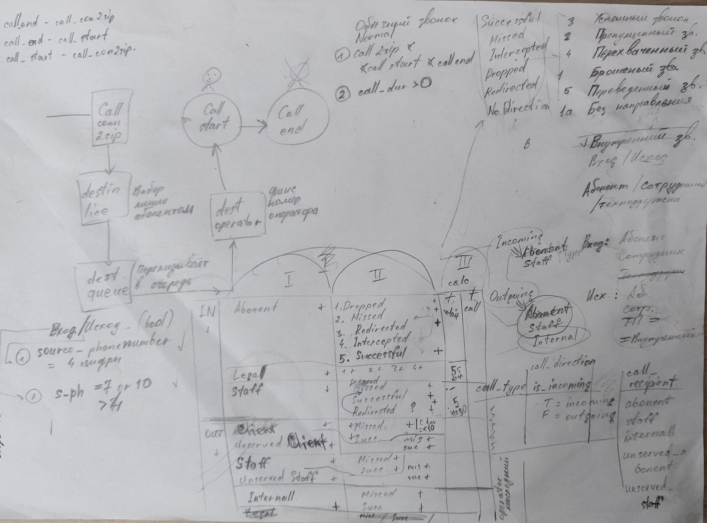

> [Начало](../../README.md) >> Модуль 3

# DataLearn Module 3

#bi #dashboard #tableau #powerbi #looker

# Домашнее задание

**Модуль 3** преследует такие цели:

- Познакомиться с основными BI инструментами, что есть на рынке.
- Хорошо изучить один выбранный инструмент
- Сделать дашборд

---

# Общее

Мне очень не хотелось делать те-же самые отчеты для Суперстора, потому что они приелись немного. Да и сами графики идентичны, пару столбчатых диаграмм и сумм по категориям товаров.

Поэтому я взял доступ к БД телефонных звонков на текущей работе, что-бы поработать с **реальными данными** и, в связи с этим, вкусить все прелести которые могут возникнуть в реальном проекте.

И меня ждало много неожиданностей :0).

# Отчет по звонкам Поддержки Клиентов (Call Center)

Прежде всего, я не могу сказать что за время построения дашбордов я сильно изучил PowerBI. Скорее по соотношению работы: 50% - это SQL и построение моделей, 30% ETL (да, пришлось забежать в 4 модуль и попользовать Pentaho) и остальные 20% - PowerBI. Да, в PowerBI можно работать с источниками и сильно преобразовывать данные, но сложные преобразования просто там просто неуместны, как по мне (о минусах в самом конце).

Когда Вы делаете отчет, у Вас есть два варианта:
- получить целостную модель, тогда Вам доступны всевозможные фильтры в разные стороны
- получить 1 таблицу для отчета, построить 1 отчет и получить фильтры в рамках этой таблицы

Мне нужно было первое. Самое сложное в работе со звонками - это разбить их на катеригории. Оригинальная таблица звонков представляет собой самописную штуку, в которой не всегда Входящий звонок (если сравнивать номер телефона с которого звонили и на какой звонили) сразу можно отличить от Исходящего.

Разбивка на категории и проверка каждого случая:

Так выглядит ETL в Pentaho:

# Dashboard (Приборная панель) :D

## Главная

Вынес только самые необходимые показатели, которые я бы хотел видеть, если бы был руководителем. Задача - понять общую нагрузку и увидеть время ожидания. Последнее дает мне понимание, сколько времени клиент ждал, пока ему ответит Оператор.

Пожалуйста, сильно не критикуйте вид фильтров слева.

## Операторы 1 линии

1 линия занимается консультациями по услугам, которые оказывает компания, и оплатами услуг. Больше всего звонков приходится на время обеда. В нижнем графике есть Unserved Client - это автоматически сформированный звонок для тех клиентов, которые ждали-ждали и положили трубку в итоге. Как видно Исходящие составляют практически такую же часть нагрузки, как и Входящие звонки. Хочется меньше исходящих, что-бы меньше платить за услуги телефонной связи.

Разбивку на бины брал по 30 минут, мельче просто не влезет в график. Еще есть нюанс - иногда разговор может длится 40 минут, начался в 10:25 и закончился в 11:05. Технически он попадать должен во все три бина по количеству проведенного там времени, но у меня такой звонок запишется только в бин 10:00 как 40 минут.

## Операторы 2 линии

Почти тоже самое, только это техническая линия. Время ожидания технического специалиста больше.

## Индивидуальная статистика

Вот эти дырки в таблице - результат отсутствия полных данных в БД. 

Пример: Оператор, заканчивая рабочих день находится в линии по приему звонков, а потом вместо того что-бы корректно выйти из статуса прием звонков - просто закрывает ПО для звонков. Следствие - нет записи в БД. Каждый такой случай надо править вручную, к сожалению. Да, можно написать скрипт на python, который будет все такие случаи проверять, но я еще не знаю python так хорошо и этот модуль ему не посвящен.

В таблицу посередине можно еще добавить много разных показателей для наглядности, но это уже мелочи.

## Insights

### 1

Что делает клиент, когда дозванивается в какую-то компанию? Обычно сейчас срабатывает автоответчик и говорит: "Что-бы попасть в Рай - нажмите 1, поехать на море - нажмите 2, заказать жареной курочки - нажмите 3..." После нажатия клиента перекидывает в тот или иной отдел. Оказывается, если не выбрать линию - клиента ни с кем не соеденит. То, что закладывается программистами и адекватному человеку кажется совсем логичным - выбрать с кем соеденить - не всегда работает))). Некоторые клиенты ничего не нажимают и слушают по кругу "Нажмите 1, нажмите 2, нажмите 3..." В таком случае в список очереди к оператору такие звонки не попадут, поскольку они не сработал выбор.

Ниже (это пример за день) максимальное время ожидания 60,93 минуты без выбора линии, 4,9 минуты при выборе 1 линии, 10,15 минуты при выборе 2 линии.

Это около одной трети от всего времени ожидания:

А это приблизительные цифры за неделю:

Так делают каждые 2 из 5 клиентов, не выбирают с кем соединить О_о.

### 2

Остальные находки относятся к сравнению индивидуальных показателей сотрудников, но т.к. некоторые статусы невозможно посчитать (некорректные данные) - нормально видно только часть и сравнивать затруднительно.

Хотя вот еще один интересный инсайт - когда Оператор звонил Клиенту, то он ждал когда с другой стороны подымут трубку более 3 минут. 

### 3

Это не относится к этому дашборду, но в целом мне показалось что строить графики основанные на обычных цифрах (финансы) гораздо легче. Раз, два - вот тебе сумма, вот тебе среднее, вот топ-10 xD.

# Минусы ПО

- Окончательный в ыбор на Power BI пал из-за огромного числа коннекторов, которые сразу доступны бесплатно + удобное окно таблиц, где на весь экран можно изучать данные. Все данные поначалу грузил из Postgres локально. Однако я обновил PowerBI и больше не смог законектиться в Postgres ни win версии, ни в WSL разных версий ubuntu на двух ПК. Какая-то проблема с сертификатами TSL, точных инструкций как решить нет, ошибка неясна.
- Power BI: странно работает с CSV. Иногда просто не загружает те-же самые файлы, которые уже добавлены в источник.
- Power BI: менее странно работает с файлами XLS (чем с CSV). Что CSV, что XLS с одной колонкой TIMESTAMP внутри портит. Иногда просто не загружает те-же самые файлы, которые уже добавлены в источник. 

- Power BI: решением стало использовать JSON для проблемных таблиц. Слава JSON! Всегда отрабатывает корректно и без вопросов.
- Power BI: скупые настройки по расположению названий визов и невозможность оптимизировать место графика в самом визе.
- Power BI: часто нельзя отменить последнее действие.
- Power BI: нет понятия интервалов. Строки типа TIME 00:04:11 не суммируются, хотя такой тип данных существует. Надо переводить в секунды (лучше до выгрузки в PBI) и только потом строить диаграммы. Приходится делать кучу лишних колонок: секунды (целые), минуты (десятичные), часы (десятиченые). Разницу TIMESTAMP тоже не считает.

- Tableau: Еще хуже работает с CSV, чем PowerBI. 

# Итог

Все таки надо будет повторить все тоже самое в Tableau. Я не хотел делать через него, потому что брал данные напрямую из Postgres'a. Но поскольку теперь исходники одновременно в трех видах (csv, xls, json) - то однозначно Tableau Public.

---

> [Начало](../../README.md) >> Модуль 3