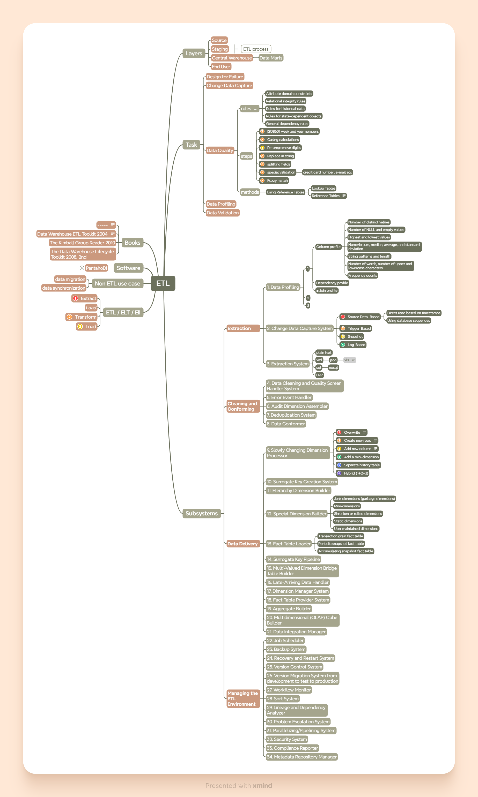

> [Начало](../../README.md) >> Модуль 4

# DataLearn Module 4

#etl #elt

# Домашнее задание

**Модуль 4** преследует такие цели:

- Знакомство с ETL
- Исследовать какой-нибудь ETL инструмент на выбор.

---

# Pentaho Data Integration

Когда я делал Модуль 3, мне пришлось перепрыгнуть и Модуль 4 и собрать ETL для доставки реальных данных по звонкам. Скрины ETL есть в Модуле три, поэтому повторятся не буду :). 

В целом мне очень понравилось. Pentaho может очень много и он очень мало весит, а так-же может биг дату. Прочитал больше половины книги Kettle Solutions, которую рекомендовали в модуле и не пожалел об этом. Было очень много вопросов по типу: "Как получить строки, которые обновлены?", "Какие преобразования лучше выполнять первыми?" Решения, как оказалось были очень простые и в целом по ETL все готово. Бери и делай. ETL подсистемы - обязательны. 

Собралось чуток забавного материала, а точнее неочевидных проблем. 

### 1

Вот, например, выгрузка таблицы из моего источника в текстовый файл. Оказывается в ячейке есть "переход на новую строку" и лесом идет весь документ. Кавычки не помогают...

### 2

Или вот. Создаю таблицу (Postgres), но `category_id` не уникальный, а просто сериал. Ведь я же буду с нее сгружать какие-то данные. На первый раз я делаю вставку данных из существующей таблицы через `SELECT *`. Как видно, счетчик `SERIAL` не обращает внимание на то, что я туда уже загрузил. 

Но если вставку делать через явное указание столбцов `SELECT name, last_update`, то счетчик работает и `category_id` увеличивается.

### 3

Нужно следить за метаданными, что на выходе идут. Если явно не указать, то можно получить колонки по 64 килобайт каждая. Pentaho лезет в базу данных, меняет там атрибуты колонки, если они не совпадают с автоматическими настройками от ETL.

Но ниже показывает, что он генерирует SQL перед отправкой данных, но в базе данных атрибуты колонки не поменялись.. Так, что как это работает, ясно не до конца. Но я думаю, что лучше все вручную указывать явно.

  

# Tableau Prep Builder

В качестве домашнего задания я сделал презентацию о возможностях Tableau Prep в рамках сообщества Surfalytics.

Подробнее в [этом разделе](../../Surfalytics/Tableau%20Prep/README.md) или посмотреть саму презентацию можно в [Tableau Public](https://public.tableau.com/app/profile/yurii.z/viz/TableauPrepPresentationForSurfalytics/Dashboard1). 

# Bonus

Можно забрать интеллект карту о [подсистемах ETL](ETL.xmind). Дополнять ее точно буду во время чтения книг про ETL (названия слева).

---

> [Начало](../../README.md) >> Модуль 4